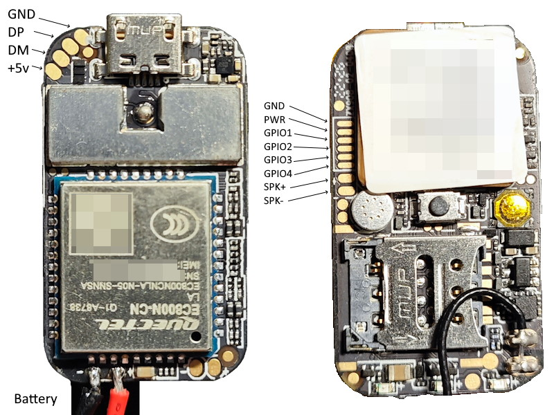

# ZX908

## Features

### Core Features

-   ✅ GPS tracking with AT6558 module
-   ✅ WiFi-based location fallback
-   ✅ Automatic sleep mode on inactivity
-   ✅ Battery monitoring with accurate percentage calculation
-   ✅ SMS command configuration
-   ✅ Voice call support
-   ✅ LED status indicators
-   ✅ Data buffering during connection loss

### LED Indicators

-   **Red**: GPS status
    -   On: GPS locked
    -   Off: GPS disabled
    -   Blinking: Searching satellites
-   **Blue**: Network status
    -   Off: No server configured / No internet
    -   Blinking: Connecting to server
    -   Pulse: Data transmission
-   **Yellow**: Battery status
    -   On: Normal operation
    -   Blinking slow: Charging
    -   Blinking fast: Low battery (<20%)
    -   Blinking very slow: Sleep mode

# HTTP Protocol

In this mode tracker will send POST JSON to server:

```json
{
	"imei": "123456789012345",
	"timestamp": 1234567890,
	"latitude": 55.751244,
	"longitude": 37.618423,
	"altitude": 156.0,
	"speed": 45.5,
	"course": 180.0,
	"satellites": 12,
	"battery": 85,
	"charging": false,
	"source": "gps",
	"accuracy": 0
}
```

### SMS Commands

| SMS (example)                                    | Explain                                            |
| ------------------------------------------------ | -------------------------------------------------- |
| `APN,internet,username,password`                 | Configure mobile internet (APN)                    |
| `SERVER,GT06,tracker.example.com:5023`           | Configure GT06 server or ~                         |
| `SERVER,HTTP,https://example.com:8080/api/track` | Configure HTTP server                              |
| `WIFISERVER,location.example.com:80,/api/locate` | Configure alternative WiFi GeoLocation Server      |
| `ADDNUMBER,+1234567890`                          | Add phone number for restrict configuration access |
| `DELNUMBER,+1234567890`                          | Remove allowed phone number                        |
| `INTERVAL,10`                                    | Set data send interval (1-600 seconds)             |
| `SLEEP,30`                                       | Set inactivity timeout / Sleep mode (Minutes)      |
| `STATUS`                                         | Request current status                             |
| `POWEROFF`                                       | Poweroff device                                    |

## Notes

-   First SMS from any number becomes the primary number
-   If no allowed numbers configured, all numbers are allowed
-   If no call numbers configured, no calls will be accepted
-   All commands are case-insensitive
-   Invalid commands will receive error response

# Techical info:

### Hardware

-   **Main chip**: Quectel EC800N-CN (LA)
-   **System**: MicroPython v.1.13.0 (mPY: 10245, Python v3.4.0, QPY v0006)
-   **mPY RAM**: 512256 bytes
-   **mPY ROM**: ~576KB in /usr/ plus ~100KB in /bak
-   **GPS Chip**: AT6558 [Datasheet](docs/at6558.pdf)
-   Microphone is preset, but there is no voiceCall class in firmware, so we can't accept or make calls
-   Power button connected to dedicated power IC. Short press - poweron, long press (10+ seconds) - poweroff.
-   Reset button just reset power of device.
-   i2c0 have two devices on address: 0x62 and 0xE2. Can't understand, what is it. Maybe its i2c interface of GPS module (there is no info in datasheet)

### Links

-   Official module page [Chinese](https://python.quectel.com/modules-cat/ec800n-series)
-   Official docs/firmware/software [Chinese](https://python.quectel.com/resource-download?pid=146&cid=6)
-   QuecPython API documentation [English](https://python.quectel.com/doc/API_reference/en/) / [Chinese](https://python.quectel.com/doc/API_reference/zh/index.html)
-   [QuecPython on GitHub](https://github.com/QuecPython)
-   [QPYcom v3.6.0 (Windows)](https://python.quectel.com/en/wp-content/uploads/sites/2/2024/11/QPYcom_V3.6.0.zip)
-   [USB Drivers (Windows)](https://python.quectel.com/wp-content/uploads/2024/09/Quectel_Windows_USB_DriverA_Customer_V1.1.13.zip)

### Firmware

-   [EC800N_QuecPython_v0004](Firmware/QPY_OCPU_V0004_EC800N_CNLA_FW.bin)
-   [EC800N_QuecPython_v0006](Firmware/QPY_OCPU_V0006_EC800N_CNLA_FW.bin)

### GPIO

| GPIO   | Pin | Function 1          | Function 2 | Notes         |
| ------ | --- | ------------------- | ---------- | ------------- |
| GPIO1  | 30  | PCM_CLK             | SPI0_CLK   | Side port #3  |
| GPIO2  | 31  | PCM_SYNC            | SPI0_CS    | Side port #4  |
| GPIO3  | 32  | PCM_DIN             | SPI0_MOSI  | Side port #5  |
| GPIO4  | 33  | PCM_DOUT            | SPI0_MISO  | Side port #6  |
| GPIO5  | 49  | LCD_RST             | PWM3       |
| GPIO6  | 50  | LCD_SPI_DOUT        | SPI1_MOSI  |
| GPIO7  | 51  | LCD_SPI_RS          | SPI1_MISO  |
| GPIO8  | 52  | LCD_SPI_CS          | SPI1_CS    |
| GPIO9  | 53  | LCD_SPI_CLK         | SPI1_CLK   |
| GPIO10 | 54  | CAM_MCLK            |            | GPS Power pin |
| GPIO11 | 55  | CAM_SPI_DATA0       |
| GPIO12 | 56  | CAM_SPI_DATA1       |
| GPIO13 | 57  | CAM_I2C_SCL         |
| GPIO14 | 58  | CAM_I2C_SDA         |
| GPIO15 | 80  | CAM_SPI_CLK         |            | Red led       |
| GPIO16 | 81  | CAM_PWDN            |            | Blue led      |
| GPIO17 | 76  | KP_MKOUT_2          |            | Yellow led    |
| GPIO18 | 77  | KP_MKIN_2           | IN2        |
| GPIO19 | 82  | USB_BOOT/KP_MKOUT_4 | OUT4       |
| GPIO20 | 83  | KP_MKIN_4           | IN4        |
| GPIO21 | 86  | KP_MKOUT_1          | OUT1       |
| GPIO22 | 87  | KP_MKIN_1           | IN1        |
| GPIO23 | 66  | I2C0_SDA            |            | Device @ 0x62 |
| GPIO24 | 67  | I2C0_SCL            |            | Device @ 0xE2 |
| GPIO25 | 17  | UART2_RXD           |            | GPS Tx        |
| GPIO26 | 18  | UART2_TXD           |            | GPS Rx        |
| GPIO27 | 19  | UART2_DTR           |            |               |
| GPIO28 | 20  | UART2_RI            |            |               |
| GPIO29 | 21  | UART2_DCD           |            |               |
| GPIO30 | 22  | UART2_CTS           |            |               |
| GPIO31 | 23  | UART2_RTS           |            |               |
| GPIO32 | 28  | UART1_RXD           | IN0        | AUX UART      |
| GPIO33 | 29  | UART1_TXD           | OUT0       |               |
| GPIO34 | 38  | UART0_RXD           |            | DEBUG UART    |
| GPIO35 | 39  | UART0_TXD           |            |               |
| GPIO36 | 16  | NET_STATUS          | PWM2       |
| GPIO37 | 78  | LCD_TE              | PWM1       |
|        | 79  |                     | PWM0       |

### Images



